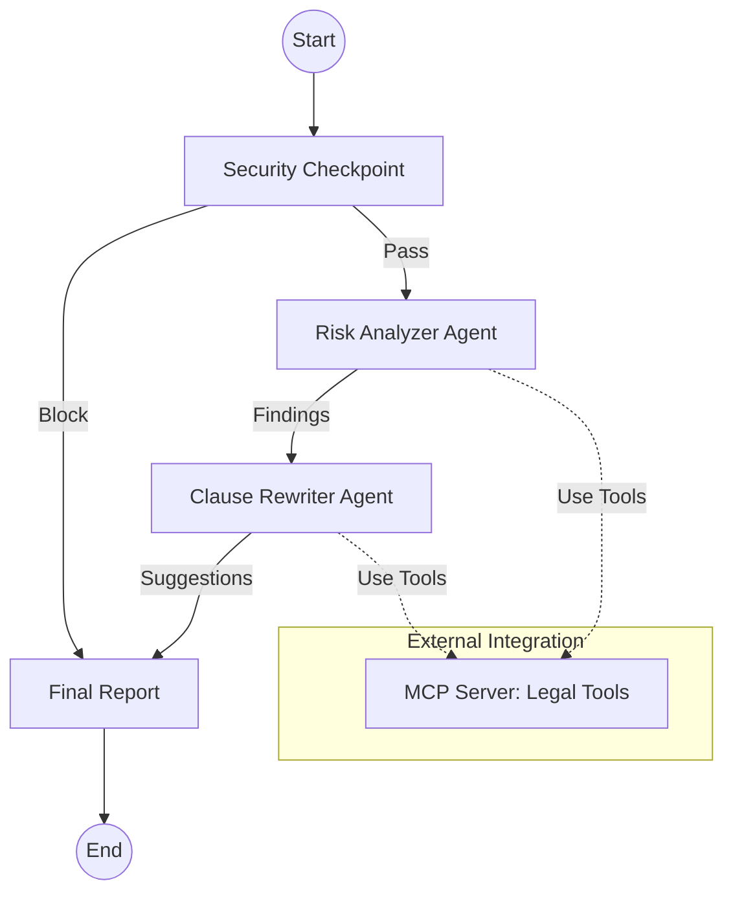

# Project Submission: Legal-Contract-Reviewer

## Problem Statement
Legal reviews are often bottlenecks in business operations. Small businesses and individual contributors often sign contracts with high-risk clauses (like unlimited liability or unfavorable indemnity) simply because they lack the immediate resources for a professional legal review or can't identify the "red flags" in complex legalese.

## Solution Architecture
The Legal-Contract-Reviewer uses a multi-agent ADK 2.0 workflow to automate the first pass of a contract review.

## Concepts Used
- **ADK Workflow:** Used for the core orchestration, ensuring a strict sequence from security to analysis to reporting. (`app/agent.py`)
- **LlmAgent:** Two specialized agents with distinct personas (Risk Counsel vs. Drafting Expert). (`app/agent.py`)
- **MCP Server:** A dedicated server providing ground-truth legal terms and company policy benchmarks. (`app/mcp_server.py`)
- **Security Checkpoint:** A dedicated workflow node implementing PII scrubbing and prompt injection defense. (`app/agent.py`)
- **Agents CLI:** Used for project scaffolding, environment management, and playground testing.

## Security Design
- **PII Scrubbing:** Uses regex to detect and flag emails and phone numbers in incoming text.
- **Injection Defense:** Guards against common LLM jailbreak attempts ("ignore instructions").
- **Audit Logging:** Every decision point is logged with a status (PASS/BLOCK) in the state for transparency.

## MCP Server Design
The server exposes three critical tools:
- `lookup_legal_term`: Standardizes definitions (e.g., force majeure).
- `fetch_policy_benchmark`: Maps internal risk appetite to contract language (e.g., "Net 30" payment terms).
- `log_audit_event`: A placeholder for enterprise-grade logging.

## Impact / Value Statement
This agent reduces the time for an initial contract "vibe check" from hours to seconds. By identifying high-risk clauses and providing safe alternatives immediately, it empowers non-legal professionals to negotiate better terms before involving expensive specialized counsel.
